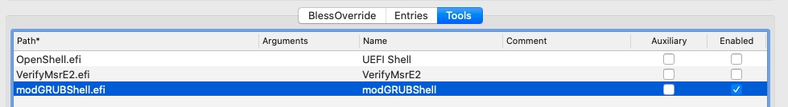
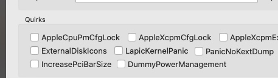

# Disabling CFG-Lock on Z390 AORUS PRO WIFI (rev. 1.0)

1. Download modGRUBShell.efi from here: https://github.com/datasone/grub-mod-setup_var/releases
    1. Move the file to the Tools folder in your OC installation.
    2. Add the modified Shell to the tools section in the config.plist file: 
2. Disable AppleCpuPmCfgLock and AppleXcpmCfgLock in Kernel -> Quriks:     
3. Reboot your system and select the "modGRUBShell" option in the boot picker. You will see a shell.
4. Type in the following, depending on your firmware version (ignore warnings if you see any):

    | Firmware Version | Command              |
    |------------------|----------------------|
    | 11 & 12c         |`setup_var 0x5C1 0x00`|
    
    ℹ️: For newer / older versions, you have to extract the offset for the variable yourself. Follow this guide: [Fixing CFG Lock](https://github.com/dortania/OpenCore-Desktop-Guide/blob/master/extras/msr-lock.md)
    
    ⚠️: These offset are only valid for the specific firmware version! Do not try to execute these commands on a different firmware! Also: The variable for the CFG-Lock will reset itself when you restore / revert to optimised defaults. Keep that in mind.
5. Type in `reboot` to reboot (first reboot might take a few seconds longer until you see the Aorus-Logo)
6. Boot into macOS as usual :)
