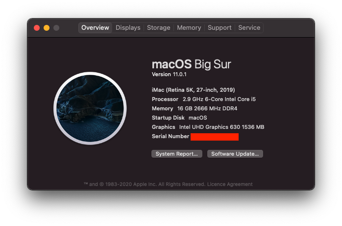
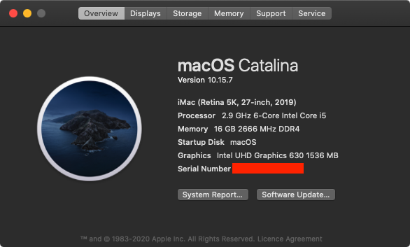

# Hackintosh Opencore 0.6.3 for Gigabyte Z390 Aorus Pro WiFi - macOS(>=10.15.2) 






### This guide is not intended for beginner, you have been warned. No support is provided unless there is a valid issue. Please read everything before starting

### Hardware

Type|Item
:----|:----
**CPU** | [Intel - Core i5-9400](https://shopee.com.my/product/18799831/1830724338)
**CPU Cooler** | [Cooler Master Hyper 212](https://shopee.com.my/product/27186464/1049199653) 
**Motherboard** | [Gigabyte - Z390 AORUS PRO WiFi](https://shopee.com.my/product/18799831/1830724338)
**Memory** | [Kingston HyperX FURY 16GB](https://shopee.com.my/product/44965307/1790719113)
**Storage (macOS)** | [ADATA XPG SX8200 Pro 512GB](https://shopee.com.my/product/84969687/1883571808)
**Storage (Windows)** | [KINGSTON A400 256GB](https://shopee.com.my/product/29242218/1103855234)
**Video Card** | [SAPPHIRE PULSE RX 5700 XT OC](about:blank)
**WiFi + Bluetooth** | [BCM943602CS](https://www.aliexpress.com/item/32847834498.html) + [PCI-E Adaptor](https://shopee.com.my/product/162227071/3405707076)
**Case** | [ECLIPSE P400A](https://shopee.com.my/product/1422162/6808915755)
**Power Supply** | [Cooler Master V1000 80+ Gold Modular](https://shopee.com.my/product/47928376/3300926225)
**Monitor 1** | [DELL U2718Q](https://www.dell.com/si/business/p/dell-u2718q-monitor/pd)
**Monitor 2** | [DELL U2720Q](https://www.dell.com/en-my/shop/ultrasharp-27-4k-usb-c-monitor-u2720q/apd/210-auzy/monitors-monitor-accessories)

### Prerequisite 
Please understand all OpenCore configuration by reading [Configuration.pdf](https://github.com/acidanthera/OpenCorePkg/blob/master/Docs/Configuration.pdf) 

### Required Tools
- [GenSMBIOS](https://github.com/corpnewt/GenSMBIOS)
- [EFI-Agent](https://github.com/headkaze/EFI-Agent)
- [Hackintool](https://github.com/headkaze/Hackintool)

### Step By Step Installation Guide
1. [BIOS configuration](BIOS.md)
2. [macOS installation media](INSTALLER.md)
3. [OpenCore EFI](OC.md)
4. [Post Installation](POST_INSTALL.md)

### Extras
#### Build-in HDMI as main display(without dGPU)
Use this for `DeviceProperties`
```
<key>PciRoot(0x0)/Pci(0x2,0x0)</key>
<dict>
	<key>AAPL,ig-platform-id</key>
	<data>AACbPg==</data>
	<key>framebuffer-patch-enable</key>
	<data>AQAAAA==</data>
	<key>framebuffer-con0-enable</key>
	<data>AAAAAA==</data>
	<key>framebuffer-con1-enable</key>
	<data>AAAAAA==</data>
	<key>framebuffer-con2-enable</key>
	<data>AQAAAA==</data>
	<key>framebuffer-con2-alldata</key>
	<data>AwQIAAAIAADHAwAA</data>
</dict>
```
#### BCM943602CS WIN10 BT/WiFi Driver
- [BCM943602CS WIN10 BT/WiFi Driver](https://mega.nz/file/h5ozUZCS#XVszB3yWDcyhaNxahbMWJLiEmnmGpqbuAnahyGDdv7Y)

### DRM
- iTunes Trailers - Software FairPlay 1.0
- iTunes Movies - Software FairPlay 1.0 - HDCP*
- TV+ - Hardware FairPlay 4.0 - HDCP*
- Prime Trailers - Hardware FairPlay 2.0/3.0 - HDCP*
- Prime/Netflix - Hardware FairPlay 2.0/3.0 - HDCP*

***HDCP**** - *All display must be connected via DP*

### What's Working/What's Not

##### Working
- Ethernet
- Onboard Audio
- HDMI Audio
- DP Audio
- IGPU in headless mode
- IGPU as main display output
- App Store
- Wake/Sleep
- Restart
- Shutdown
- USB (Correct SS/HS speed)
- All DP and HDMI port
- Dual monitor from boot
- Apple Music (iTunes)
- iMessage
- Facetime
- Handoff
- Airdrop
- Continuity
- AirPlay
- Apple TV+ (Only on Catalina, Safari 13)
- Netflix/Prime in Safari - (Only on Catalina, , Safari 13)

##### Not Tested
- FileVault
- Power Nap

##### Not Working
- Built-in WiFi and Bluetooth. This will never work, dont even waste time here. If you absolutely need Bluetooth and WiFi, get the BCM94360CS2 card.
