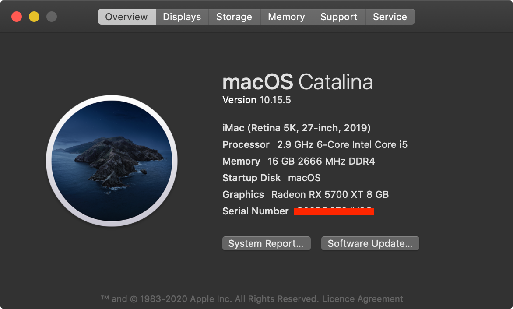

# Hackintosh Opencore 0.5.8 Installation Guide for Gigabyte Z390 Aorus Pro WiFi - Catalina(>=10.15.2) 

### This guide is not intended for beginner

### Hardware

Type|Item
:----|:----
**CPU** | [Intel - Core i5-9400](https://shopee.com.my/product/18799831/1830724338)
**CPU Cooler** | [Cooler Master Hyper 212](https://shopee.com.my/product/27186464/1049199653) 
**Motherboard** | [Gigabyte - Z390 AORUS PRO WiFi](https://shopee.com.my/product/18799831/1830724338)
**Memory** | [Kingston HyperX FURY 16GB](https://shopee.com.my/product/44965307/1790719113)
**Storage (macOS)** | [ADATA XPG SX8200 Pro 512GB](https://shopee.com.my/product/84969687/1883571808)
**Storage (Windows)** | [KINGSTON A400 256GB](https://shopee.com.my/product/29242218/1103855234)
**Video Card** | [SAPPHIRE PULSE RX 5700 XT OC](about:blank)
**WiFi + Bluetooth** | [BCM943602CS](https://www.aliexpress.com/item/32847834498.html) + [PCI-E Adaptor](https://shopee.com.my/product/162227071/3405707076)
**Case** | [ECLIPSE P400A](https://shopee.com.my/product/1422162/6808915755)
**Power Supply** | [Cooler Master V1000 80+ Gold Modular](https://shopee.com.my/product/47928376/3300926225)
**Monitor 1** | [DELL U2718Q](https://www.dell.com/en-my/shop/dell-ultrasharp-27-4k-monitor-u2718q/apd/210-amuf/monitors-monitor-accessories)
**Monitor 2** | [DELL U2312HM](https://www.dell.com/ng/business/p/dell-u2312h/pd)

### Step By Step Installation Guide

[STEP_BY_STEP.md](STEP_BY_STEP.md)

### USB Configuration

[USBMAP.md](USBMAP.md)

### Fixing CFG-Lock for Z390 AORUS PRO WIFI

[DISABLING_CFG_LOCK.md](DISABLING_CFG_LOCK.md)

### What's Working/What's Not

##### Working
- Ethernet
- Onboard Audio
- HDMI Audio
- DP Audio
- IGPU in headless mode
- App Store
- Wake/Sleep
- Restart
- Shutdown
- USB (Correct SS/HS speed)
- All DP and HDMI port
- Dual monitor from boot
- Apple Music (iTunes)
- iMessage
- Facetime
- Handoff
- Airdrop
- Continuity
- AirPlay

##### Not Tested
- FileVault
- Power Nap

##### Not Working
- Built-in WiFi and Bluetooth. This will never work, dont even waste time here. If you absolutely need Bluetooth and WiFi, get the BCM94360CS2 card.
- Netflix in Safari