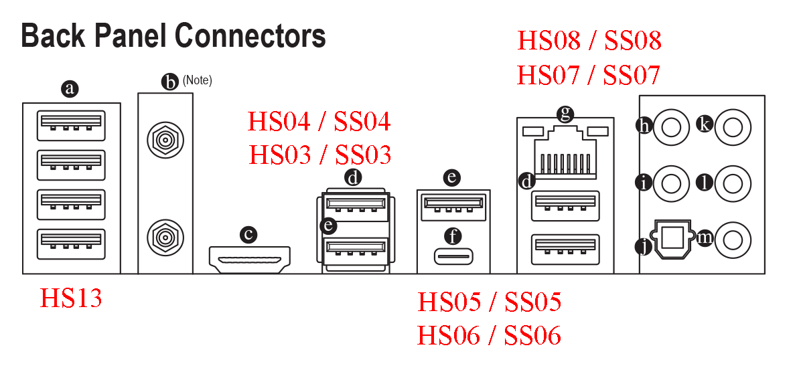
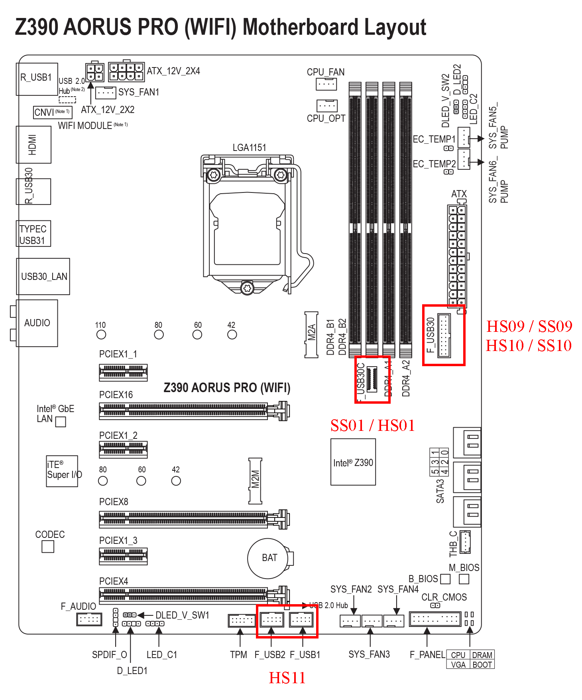

### USB Mapping

#### All Available USB Ports

- HS01 / SS01 - Unknown (Font USB-C ?)
- HS02 / SS02 - Unknown
- HS03 / SS03 - Rear USB 3.1 Gen 2 Type-A Port(Red)
- HS04 / SS04 - Rear USB 3.1 Gen 1 Port
- HS05 / SS05 - Rear USB 3.1 Gen 2 Type-A Port(Red)
- HS06 / SS06 - Rear USB Type-C Port
- HS07 / SS07 - Rear USB 3.1 Gen 1 Port
- HS08 / SS08 - Rear USB 3.1 Gen 1 Port
- HS09 / SS09 - Front USB 3.1 Gen 1 Port
- HS10 / SS10 - Front USB 3.1 Gen 1 Port
- HS11 - Internal USB 2.0 #1 and #2
- HS12 - Unknown 
- HS13 - Rear USB 2.0 (All 4 ports)
- HS14 - Unknown (Bluetooth ?)
- USR1 - Unknown
- USR2 - Unknown

#### Enabled Ports

- SS03 - Rear USB 3.1 Gen 2 Type-A Port(Red)
- SS04 - Rear USB 3.1 Gen 1 Port
- SS05 - Rear USB 3.1 Gen 2 Type-A Port(Red)
- SS06 - Rear USB Type-C Port
- HS07 / SS07 - Rear USB 3.1 Gen 1 Port
- HS08 / SS08 - Rear USB 3.1 Gen 1 Port
- HS09 / SS09 - Front USB 3.1 Gen 1 Port
- HS10 / SS10 - Front USB 3.1 Gen 1 Port
- HS11 - Internal USB 2.0 #1 and #2
- HS12 - Unknown 
- HS13 - Rear USB 2.0 (All 4 ports)

Total of 15 ports, matching Apple's 15 port limit

#### Ports Location

